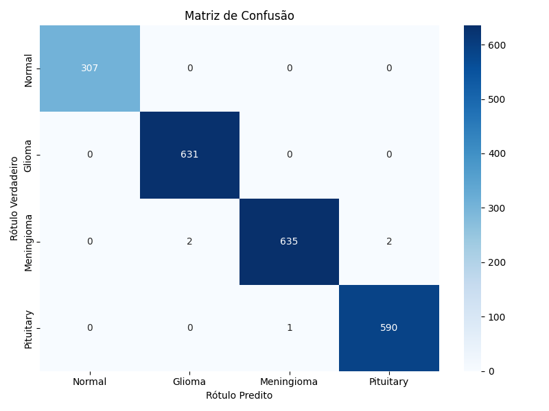

# Classificação de Tumores Cerebrais com EfficientNetB0 + Explicabilidade (XAI)

Projeto de classificação de imagens de ressonância magnética (MRI) em 4 classes
(`Normal`, `glioma_tumor`, `meningioma_tumor`, `pituitary_tumor`), usando
**transfer learning com EfficientNetB0**, com foco em duas frentes:

1. **Robustez do treino** — múltiplas execuções (seeds diferentes) para medir a
   variabilidade das métricas do modelo (média ± desvio padrão).
2. **Explicabilidade (XAI)** — geração e avaliação quantitativa de explicações
   visuais das predições com **Grad-CAM++**, **LIME** e **SHAP**.

## Estrutura do repositório

| Notebook | Descrição |
|---|---|
| `_VERSAO_7__Modelo_Desvio_Hiperparametro.ipynb` | Pipeline completo de treino: pré-processamento/segmentação das imagens, busca de hiperparâmetros (Keras Tuner / Hyperband), treino em múltiplas seeds (transfer learning + fine-tuning) e avaliação (accuracy, precision, recall, F1, matriz de confusão). |
| `_VERSAO_3__Modulos_Explicabilidade_com_Gini_AOPC.ipynb` | Módulos independentes de explicabilidade (Grad-CAM++, LIME, SHAP) aplicados ao melhor modelo treinado, com avaliação quantitativa das explicações via **Índice de Gini** e **AOPC**. |

## Pipeline

### 1. Pré-processamento e segmentação
As imagens de MRI passam por uma segmentação com OpenCV (Otsu + maior
componente conectado + convex hull) para isolar a região do cérebro antes do
treino, reduzindo ruído de fundo. A segmentação é feita uma única vez e salva
em disco, evitando gargalo de CPU durante o treino em GPU.

### 2. Modelo
- **Arquitetura base:** EfficientNetB0 pré-treinada na ImageNet (transfer learning), com cabeça de classificação customizada (Dense + Dropout + regularização L2).
- **Busca de hiperparâmetros:** Keras Tuner (Hyperband), otimizando a arquitetura da cabeça (dropout, unidades da camada densa, regularização L2, learning rate).
- **Treino em duas fases:** (1) transfer learning com a base congelada e (2) fine-tuning com a base descongelada e learning rate reduzido.
- **Tamanho de imagem:** 224x224.

### 3. Avaliação de robustez (múltiplas seeds)
O treino completo (fases 1 e 2) é repetido para **5 seeds diferentes**
(`42, 123, 2024, 7, 55`), salvando incrementalmente os resultados em JSON.
Ao final, calcula-se média e desvio padrão amostral (ddof=1) de:
- Loss
- Accuracy
- Precision
- Recall
- F1-score

O modelo com melhor F1 entre as execuções é usado para gerar a matriz de
confusão final e como modelo de referência nos módulos de explicabilidade.

### 4. Explicabilidade (XAI)
Aplicada sobre o melhor modelo treinado, por classe:

- **Grad-CAM++** — mapas de calor das regiões que mais influenciaram a predição.
- **LIME** — explicação por perturbação de superpixels (com 3 modos de visualização: comparativo, prós/contras e isolamento).
- **SHAP** — atribuição pixel a pixel via `shap.Explainer` (masker de imagem, abordagem black-box).

### 5. Avaliação quantitativa das explicações
Cada técnica de XAI é avaliada com duas métricas, por imagem e por classe:

- **Índice de Gini** — mede o quão *concentrada* está a importância atribuída pela explicação (0 = espalhada por toda a imagem, 1 = concentrada em poucos pixels/regiões).
- **AOPC (Area Over the Perturbation Curve)** — mede o quanto a probabilidade da classe predita cai ao remover progressivamente as regiões apontadas como mais importantes. Quanto **maior**, mais a explicação de fato aponta para regiões relevantes para a decisão do modelo.

Os resultados são salvos incrementalmente e consolidados em um relatório
(médias e desvios por técnica e por classe), exportado também como CSV.

## Como executar

Os notebooks foram desenvolvidos para rodar no **Google Colab**, com o dataset
baixado via `kagglehub` e os artefatos (modelos, gráficos, métricas) salvos no
Google Drive.

1. Execute `_VERSAO_7__Modelo_Desvio_Hiperparametro.ipynb`:
   - Seção 1–2: configuração, download e segmentação do dataset.
   - Seção 3.1: busca de hiperparâmetros (executar uma vez; resultado fica salvo em `melhores_hiperparametros.json`).
   - Seção 5: treino das 5 seeds (uma execução da célula = uma seed).
   - Seção 6–7: métricas consolidadas e matriz de confusão.
2. Execute `_VERSAO_3__Modulos_Explicabilidade_com_Gini_AOPC.ipynb`:
   - **Módulo 0** (sempre primeiro): carrega o melhor modelo treinado e monta o banco de imagens de exemplo.
   - **Módulos 1–3**: gere as explicações (Grad-CAM++, LIME, SHAP) e as respectivas avaliações (Gini/AOPC), classe a classe.
   - **Módulo 4**: relatório consolidado com médias, desvios e exportação em CSV.

### Dependências principais
`tensorflow` / `keras`, `keras-tuner`, `opencv-python`, `scikit-learn`,
`scikit-image`, `lime`, `shap`, `numpy`, `pandas`, `matplotlib`, `seaborn`,
`kagglehub`.

## Resultados

> ⚠️ Seção a preencher com os resultados finais obtidos.

### Desempenho do modelo (média ± desvio padrão, 5 seeds)

| Métrica | Média | Desvio Padrão |
|---|---|---|
| Accuracy | `98.75%` | `0.39%` |
| Precision | `98.81%` | `0.36%` |
| Recall | `98.72%` | `0.40%` |
| F1-score | `98.75%` | `0.39%` |
| Loss | `0.1236` | `0.0169` |

### Matriz de confusão (melhor execução)



### Avaliação das explicações (Gini / AOPC)

| Técnica | Gini (média ± dp) | AOPC (média ± dp) |
|---|---|---|
| Grad-CAM++ | `TODO` | `TODO` |
| LIME | `TODO` | `TODO` |
| SHAP | `TODO` | `TODO` |

### Exemplos visuais

`[placeholder — inserir exemplos de heatmaps/explicações por classe (Normal, glioma, meningioma, pituitary)]`

## Estrutura de diretórios (Google Drive)

```
Projeto/Desv_Hip/
└── 224x224/
    ├── modelos_salvos/        # modelos .keras por seed
    ├── graficos/               # curvas de loss/accuracy por seed
    ├── tuner/                  # progresso do Keras Tuner (Hyperband)
    ├── dados/                  # execucoes.json, splits, hiperparâmetros
    └── explicabilidade/
        ├── GradCAM/
        ├── LIME/
        ├── SHAP/
        └── metricas/            # gini/aopc por técnica e classe
```

## Licença

`TODO`
